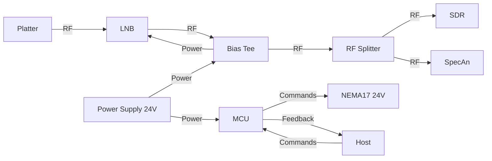

# Platter
 A 3D printed modular satellite dish with automated motion controls

 Platter is a controllable satellite dish, with an open-source ecosystem from start to finish.
 It is made of three main components:
  1. **Gourmet**: the web interfaced used to manage and control the dish
  2. **Plattpy**: a modified version of klipper's klippy, which adds a dish as a motion control system, enabling satellite pointing
  3. **Platter**: the 3D printed dish, with off-the-shelf external components that are easy to source and inexpensive

These components combine to enable easy access, management, and control to closed source and expensive ecosystems, while affording similar quality of life features.

# Table of Contents
 - [Gourmet](https://github.com/Anonoei/Platter#gourmet)
 - [Plattpy](https://github.com/Anonoei/Platter#plattpy)
 - [Platter](https://github.com/Anonoei/Platter#platter)

## Gourmet
 Web GUI for controlling the dish

## Plattpy
 Modified klippy with dish motion system

## Platter
 3D printed satellite dish with motion system

### BOM
 - M3 Bolts
   - Sizes will be listed here
 - [M3x5x4mm heatset inserts (Voron Spec)](https://www.aliexpress.us/item/2255800046543591.html?spm=a2g0s.9042311.0.0.21164c4dGhWHhY&gatewayAdapt=glo2usa4itemAdapt)
 - [3x 2RS bearings (15x32x9mm)](https://a.co/d/7PS2tth)
 - [Aluminum tape](https://a.co/d/cBhdCiR)
 - 2x NEMA17 Stepper Motors ([link 1](https://www.fabreeko.com/products/ldo-42sth48-2804-ac-ah-ahs80-super-power-motors-by-ldo?variant=43913432858879), [link 2](https://kb-3d.com/store/stepper-motors/64-ldo-stepper-motor-nema-17-42sth48-1684mac-1642876248477.html))
 - Klipper MCU (BTT Pico) - Runs klipper
 - Host (Raspberry Pi) - Runs klipper/plattpy/gourmet
 - An LNB (and required cabling/power)]

Example LNB/electronics wiring diagram
